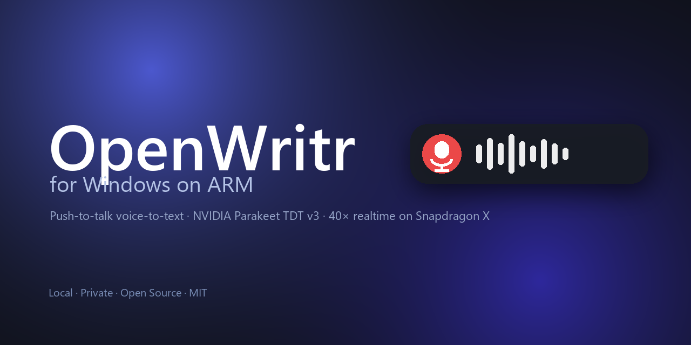

# OpenWritr for Windows (ARM64)



[](https://github.com/trsdn/openwritr-windows)
[](LICENSE)

Push-to-talk voice-to-text tray app for **Windows on ARM** (Snapdragon X).
Local transcription via **NVIDIA Parakeet TDT 0.6B v3** (INT8 ONNX, 25 languages),
~40× realtime on the Snapdragon X CPU. Optional LLM cleanup via GitHub Copilot
or any OpenAI-compatible endpoint.

Windows port of [trsdn/OpenWritr](https://github.com/trsdn/OpenWritr).

## Quick start

```powershell
git clone https://github.com/trsdn/openwritr-windows.git
cd openwritr-windows
py -3.11-arm64 -m venv .venv
.\.venv\Scripts\Activate.ps1
pip install -r python\requirements.txt
python python\fetch_model.py        # ~640 MB, one-time
python python\openwritr.py
```

A blue microphone icon appears in your system tray. **Hold `Ctrl + Shift + Space`**,
speak, release — the text is pasted at the caret.


Right-click the tray icon for **Settings…** to configure the hotkey, toggle the
overlay/sounds, and choose an LLM enhance provider (GitHub Copilot or any
OpenAI-compatible API).

## Features

- Push-to-talk hotkey with live audio-level meter overlay (Mica backdrop, Fluent style)
- 25 languages, runs fully offline after the one-time model download
- Optional cleanup pass via **GitHub Copilot** (uses your `gh auth token`) or any **OpenAI-compatible** endpoint
- Auto-paste at cursor, clipboard save/restore
- Start/stop sounds (Windows system WAVs)
- HiDPI-correct rendering on Surface Pro displays

## Status

| Build | State | Latency on Snapdragon X |
|---|---|---|
| **Python (`python/`)** | **runs today** | 0.27s / 11s audio = ~43x realtime on CPU |
| Rust + Tauri (`src-tauri/`) | scaffold + ASR pipeline code-complete, not built | target: NPU < 1s |

Start with the [Python build](python/README.md). The Rust port is the long-term
target for a smaller, NPU-accelerated bundle.

## Target Performance

| Metric | macOS (ANE) | Windows ARM64 target |
|---|---|---|
| End-to-end latency | < 1 s | < 1 s on NPU, < 2.5 s DirectML, < 4 s CPU |
| Model | Parakeet TDT 0.6B v3 (CoreML) | Parakeet TDT 0.6B v3 (ONNX, FP16) |
| Inference | Apple Neural Engine | Qualcomm Hexagon NPU via QNN EP |
| Runtime memory | ~38 MB | target < 120 MB |
| Bundle | 7.9 MB | target < 25 MB (model downloaded on first launch) |

## Architecture

```
openwritr-windows/
├── src-tauri/                  Rust core
│   ├── src/
│   │   ├── main.rs             tray app, state machine, IPC
│   │   ├── audio/              cpal WASAPI 16 kHz capture
│   │   ├── hotkey/             global-hotkey + FSM
│   │   ├── asr/                ort + QNN/DirectML/CPU EP, TDT greedy decode
│   │   ├── paste/              enigo Ctrl+V + clipboard save/restore
│   │   └── enhance/            Copilot / OpenAI grammar provider
│   └── tauri.conf.json
├── src/                        SvelteKit / vanilla UI for settings + overlay
├── scripts/
│   └── export_parakeet_onnx.py NeMo → ONNX export + FP16 quantization
└── .github/workflows/          ARM64 build + sign + release
```

## Build (Snapdragon X dev machine)

```powershell
# prerequisites: Rust (stable, aarch64-pc-windows-msvc), Node 20+, pnpm
winget install Rustlang.Rustup Microsoft.NodeJS
rustup target add aarch64-pc-windows-msvc
npm install -g pnpm

pnpm install
pnpm tauri dev          # local run
pnpm tauri build --target aarch64-pc-windows-msvc
```

## CI

The GitHub Actions workflow ships as `docs/build.yml.workflow-template`
(the initial commit was pushed with an OAuth token lacking `workflow` scope).
To activate it once:

```powershell
gh auth refresh -h github.com -s workflow
mkdir .github\workflows
git mv docs\build.yml.workflow-template .github\workflows\build.yml
git commit -m "ci: enable Windows ARM64 build workflow"
git push
```

## License

MIT — see [LICENSE](LICENSE).

Upstream macOS app: [trsdn/OpenWritr](https://github.com/trsdn/OpenWritr).
